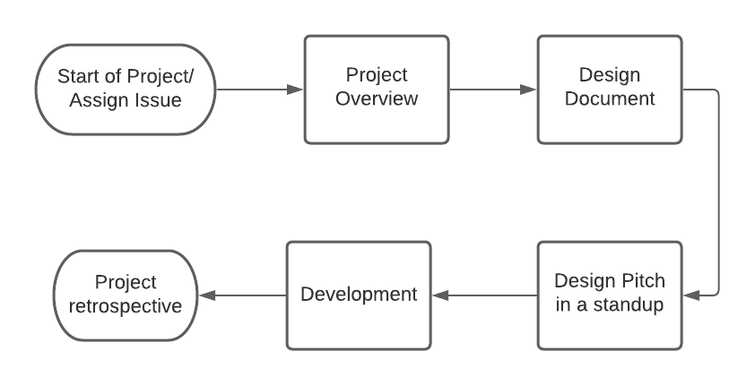
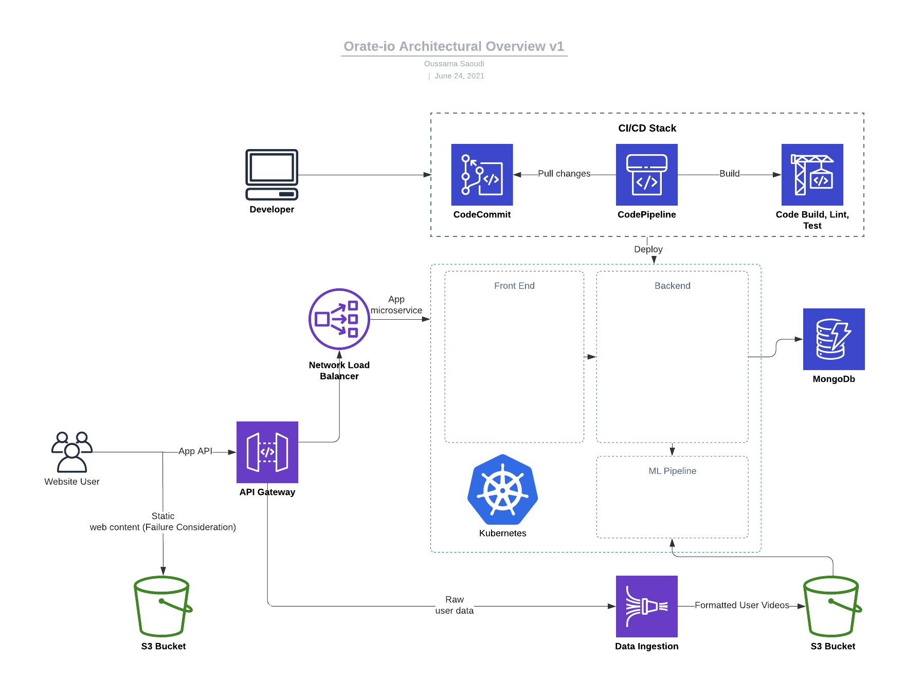

# Orate<area>.io

Orate<area>.io is a platform for improving your speaking with the power of AI! It is a web application which performs the following functions:

- **Speech pattern analysis**: Analyze your speech patterns by getting data on your frequently used words and phrases. It will also analysze your grammar and emotion of your speech.
- **Crutch word counter**: Find all the points in your speech where you use crutch words. Ums, ahs, and superfluous use of conjunctions such as 'and', 'but', and 'so' will be detected. Speakers seek to reduce these crutch words to keep the signal and reduce the noise in your speech.
- **Camera Eye Contact tracker**: Keeping eye contact with the camera is vital in keeping the audience engaged during a virtual speech. With zoom taking over, this tool will tell you how often you are looking at your audience so that you can improve your eye contact and kepe your audience engrossed.
- **Hands and body language analysis**: Body language can greatly impact a speech. Too little and your speech is too static and stiff. Too much and the movement gets distracting. This tool will tell you how often you speak with your hands and suggest to reduce or increase your movement.

## How to contribute?

### Prerequisite Knowledge

If you are interested in getting involved but don't know where to start, we've got you covered! Check out our [perscribed course on full stack development](https://fullstackopen.com/en/), which will get you set up with the entire webstack and testing frameworks we use.

### The Git Workflow

The workflow will be a Git Fork Workflow. [This link](https://www.atlassian.com/git/tutorials/comparing-workflows/forking-workflow) will demonstrate how the workflow works, and [this link](https://medium.com/@ruthmpardee/git-fork-workflow-using-rebase-587a144be470) will show you how you can get started contributing.

### Development Process

Below is an overview of the process.



1. **Start of the Project, Assign Issue:** Marking the beginning of your project is an issue which needs to be addressed. The issue will be assigned during the beginning of a sprint. An issue will give an outline of the feature that you need to add or the bug you must fix.
2. **Project Overview:** After being assigned your first issue, you will need to write a Project Overview which will outline your goals and milestones for the project.
3. **Design Document:** Once your Project Overview is finalized, you will want to write a Design Document which will provide more details to the feature you are developing. This document is meant to be a living, breathing document that is modified with each update to the component such as its scope, testing considerations, requirements, alternative considerations, or actualized future considerations.
4. **Design Pitch:** Following the creation of the Design Document, you will need to pitch the design to the team or the lead developer in order to add to or modify the document.
5. **Development:** Once the Design has been approved by the lead developer or team, you can get to implementing your design! Make sure to check our Coding Standards so that your code adheres to it, and ensure that all tests pass. When you're done with your code, submit a PR, have it reviewed, fix any issues that need to be addressed, and finally wait for you PR to be merged.
6. **Project Retrospective:** In this phase you will present your design to the team and get feedback on your work at the end of a sprint. Your work presentation will be at the next retrospective meeting whenever your PR is merged.

### Commit Standards

Commit standards help to keep consistent quality throughout the code. Below are standards that we enforce:

- End final commit with ```-s``` flag like so: ```git commit -s```
- All automated testing must pass for code to be eligible to merge. If your code does not pass tests, make sure to resolve any issues.
- Reviewer comments must be addressed by the committer before PR is eligible to be merged.
- If your commit relates to, but does not close an existing issue, mention it in your commit message. If your commit addresses and closes an issue, show that you close it in the commit and PR message. This helps with automated workflow and maintains clear relation between issues and commits.
  - Showing Relation: ```Relates to: https://github.com/orate-io/orate-io-repo/issues/#```
  - Closing an issue: ```Closes: https://github.com/orate-io/orate-io-repo/issues/#```
- If your commit depends on another PR, you must refer to it in your commit and PR message.
  - Depends on other PR: ```Depends on: https://github.com/orate-io/orate-io-repo/pull/#```

## Orate<area>.io Technical Overview

Below is the architecture overview of Orate<area>.io.


### Web Stack

Orate<area>.io is built as a MERN webstack, meaning that it will use React as the front end, Express and Nodejs as the backend, and MongoDb as the database. Redux will be used for state mangement.

### Infrastructure

We will be using kubernetes for containerization and handling microservices. It will also leverage AWS S3 as a data lake to store video data.
