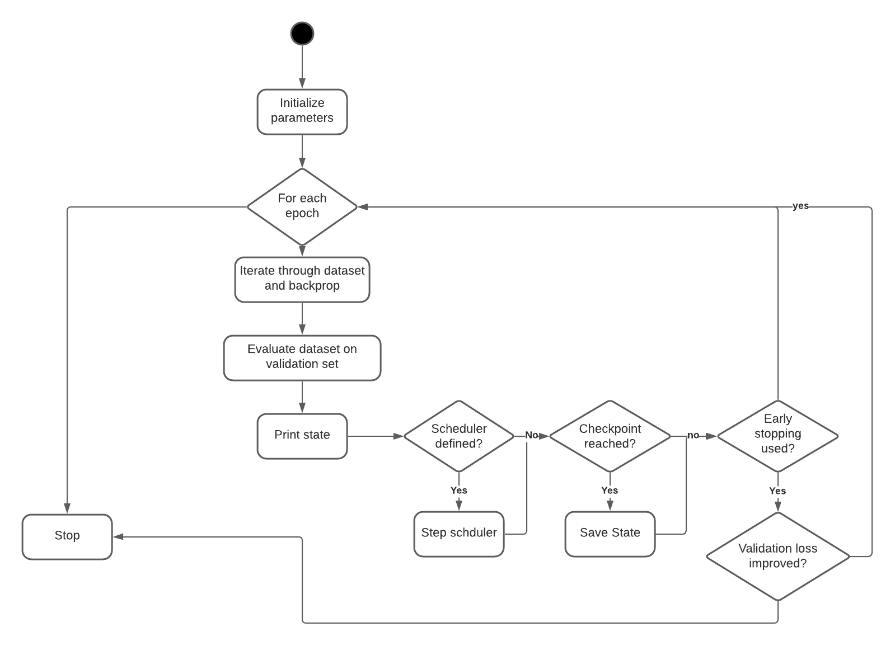

# Design Document

## Overview

The training utilities will encompass reusable components used in many training scenarios. This may include utilities for NLP, CV, or both types of training.

- The utilities include a Trainer for running the training loop for a model and optimizer with optional features such as scheduler stepping and early stopping.
- The utilities will also include a function to get the mean and standard deviation of a dataset.

## Assumptions/Requirements

Here you write what the is in and out of scope for project

- The training utilities shall be for model training only, and will not be used in production.
- The Trainer must have option to enable early stopping
- The Trainer must have option to enable scheduler.
- The trainer must be dataset agnostic.
- The utilities shall not generate model architecture.
- It is assumed that the model input only outputs the prediction tensor and not a dictionary.

## Solution


Above is the UML activity diagram for the trainer to understand the implementation.

The other utility that will be implemented gets the norm of each channel in image datasets.

## Alternative Considerations

- When passing a dataset, there may be different ways to access the training data from the ```getitem``` funciton. We could pass dictionary name which gets the correct item from ```getitem```. We will instead use function passing to maintain generality and make the Trainer future-proof.

## Testing considerations

- Testing the early stopping on a model by monitoring the validation error.
- Testing the mean and normalization on a randomly generated matrix and checking correctness.

## Future Considerations

- Add graphing capability to plot the validation and training error over epochs
